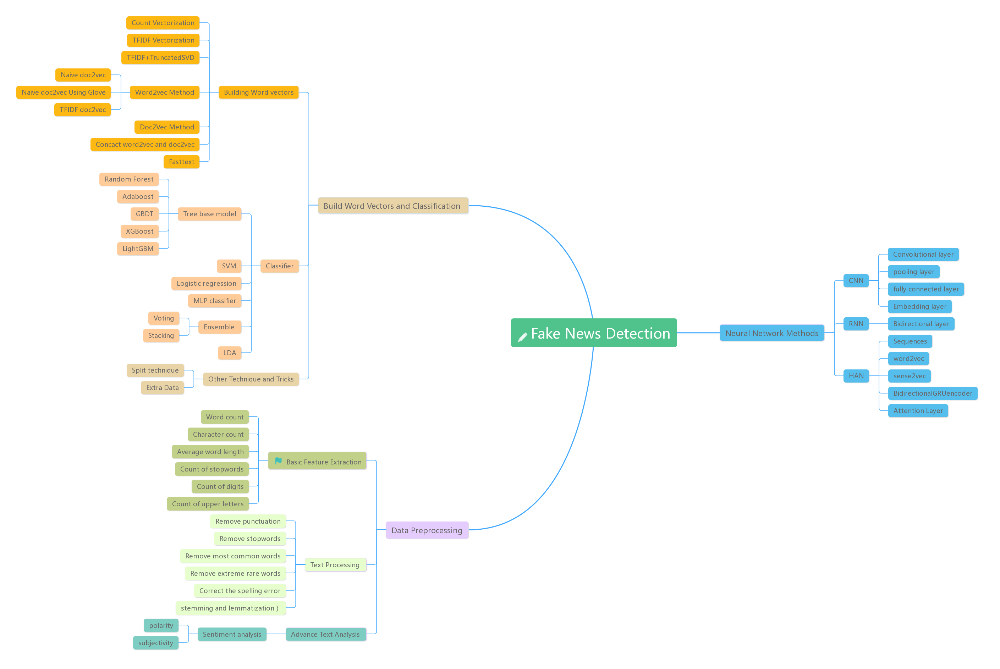
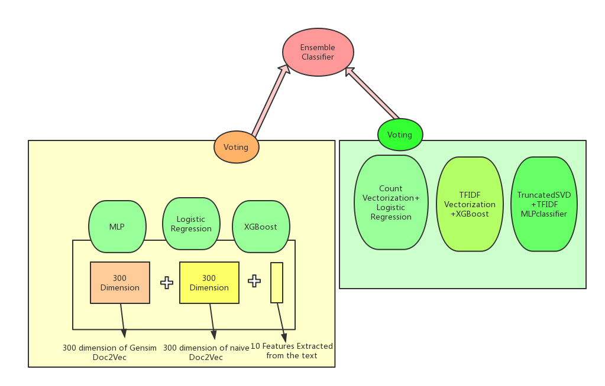
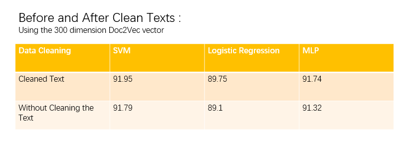
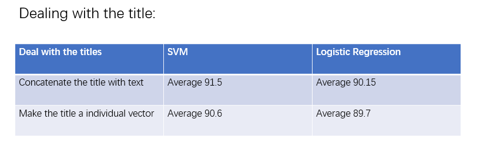
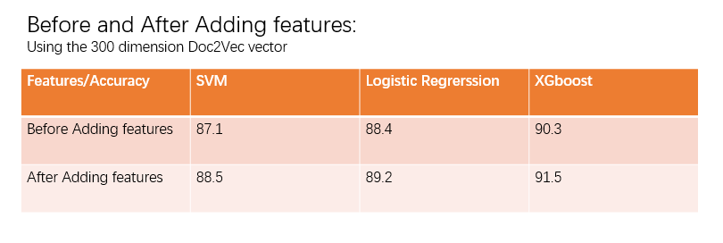
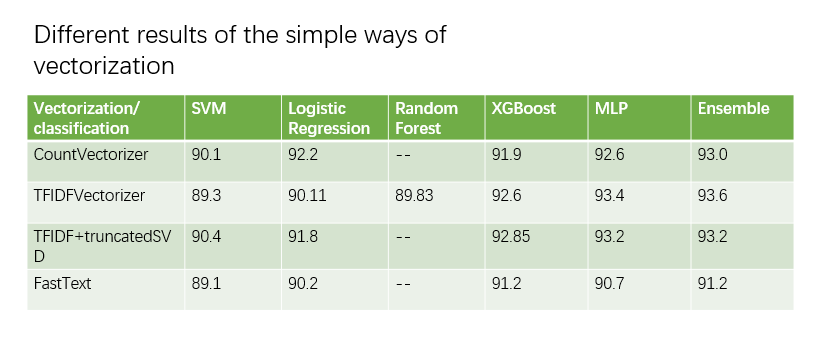
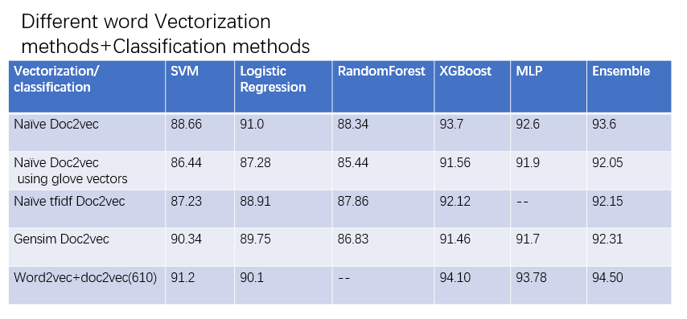

# FakeNews-Detection
Fake news detection using both ensembled model and HAN nearal network<br>
we can achieve 94.8% accuracy using the first model and higher than 98% using the second one.


# Group4 Final Project

### Yao Zonghai
### Li Mingyang
### Mei Longxiang




```python
import pandas as pd
df = pd.read_csv('fake_or_real_news.csv')
df.tail()

#替换列名
df.rename(columns={"label":"fake"}, inplace=True)
label_map = {"FAKE": 1, "REAL": 0}
df['fake'] = df['fake'].map(label_map)


#丢掉无用的列
df = df.drop(['Unnamed: 0','title_vectors'],axis=1)

df = df.reset_index(drop=True)
```


```python
import re

#正则表达式去掉一些无用的形式
def execute(x):
    temp=x
    pat1 = "[a-zA-Z]+'t"
    #substitude the ***'t' words with not ***
    temp = re.sub(pat1, 'not', temp)
    pat2 = "[a-zA-Z]+’t"

    temp = re.sub(pat2, 'not', temp)
    #邮箱地址
    pat3="[\w!#$%&'*+/=?^_`{|}~-]+(?:\.[\w!#$%&'*+/=?^_`{|}~-]+)*@(?:[\w](?:[\w-]*[\w])?\.)+[\w](?:[\w-]*[\w])?"
    temp = re.sub(pat3, 'email', temp)
    #url网址
    pat4="[a-zA-z]+://[^\s]*"
    temp = re.sub(pat4, 'url', temp)
    #日期
    pat5="([0-9]{3}[1-9]|[0-9]{2}[1-9][0-9]{1}|[0-9]{1}[1-9][0-9]{2}|[1-9][0-9]{3})-(((0[13578]|1[02])-(0[1-9]|[12][0-9]|3[01]))|((0[469]|11)-(0[1-9]|[12][0-9]|30))|(02-(0[1-9]|[1][0-9]|2[0-8])))"
    temp = re.sub(pat5, 'date', temp)
    #电话号码 qq号码等 各种数字串
    pat6="[0-9]+"
    temp = re.sub(pat6, 'number', temp)
    return temp

def text_execute(x):
    return execute(x['text'])

def title_execute(x):
    return execute(x['title'])
    

df['text'] = df.apply(text_execute,axis=1)
```









TextBlob is a Python (2 and 3) library for processing textual data. It provides a simple API for diving into common natural language processing (NLP) tasks such as part-of-speech tagging, noun phrase extraction, sentiment analysis, classification, translation, and more.
Here we use textblob for sentiment analysis, and the range of polarity is -1 to 1, the range of subjectivity is from 0 to 1.


```python
from textblob import TextBlob
# df['text'].apply(lambda x: str(TextBlob(x).correct()))

df['sentiment_polarity'] = df['text'].apply(lambda x: TextBlob(x).sentiment[0] )
df['sentiment_subjectivity'] = df['text'].apply(lambda x: TextBlob(x).sentiment[1] )
```


```python
df.head()
```


<div>
<style scoped>
    .dataframe tbody tr th:only-of-type {
        vertical-align: middle;
    }

    .dataframe tbody tr th {
        vertical-align: top;
    }

    .dataframe thead th {
        text-align: right;
    }
</style>
<table border="1" class="dataframe">
  <thead>
    <tr style="text-align: right;">
      <th></th>
      <th>title</th>
      <th>text</th>
      <th>fake</th>
      <th>numerics</th>
      <th>sentence_count</th>
      <th>word_count</th>
      <th>char_count</th>
      <th>avg_word</th>
      <th>stopwords</th>
      <th>upper</th>
      <th>hashtags</th>
      <th>sentiment_polarity</th>
      <th>sentiment_subjectivity</th>
    </tr>
  </thead>
  <tbody>
    <tr>
      <th>0</th>
      <td>You Can Smell Hillary’s Fear</td>
      <td>Daniel Greenfield, a Shillman Journalism Fello...</td>
      <td>1</td>
      <td>0</td>
      <td>87</td>
      <td>1298</td>
      <td>7513</td>
      <td>5.788136</td>
      <td>534</td>
      <td>38</td>
      <td>0</td>
      <td>0.059595</td>
      <td>0.562654</td>
    </tr>
    <tr>
      <th>1</th>
      <td>Watch The Exact Moment Paul Ryan Committed Pol...</td>
      <td>Google Pinterest Digg Linkedin Reddit Stumbleu...</td>
      <td>1</td>
      <td>0</td>
      <td>26</td>
      <td>446</td>
      <td>2641</td>
      <td>5.921525</td>
      <td>176</td>
      <td>3</td>
      <td>0</td>
      <td>0.082652</td>
      <td>0.518638</td>
    </tr>
    <tr>
      <th>2</th>
      <td>Kerry to go to Paris in gesture of sympathy</td>
      <td>U.S. Secretary of State John F. Kerry said Mon...</td>
      <td>0</td>
      <td>0</td>
      <td>16</td>
      <td>423</td>
      <td>2549</td>
      <td>6.026005</td>
      <td>173</td>
      <td>6</td>
      <td>0</td>
      <td>0.102574</td>
      <td>0.348775</td>
    </tr>
    <tr>
      <th>3</th>
      <td>Bernie supporters on Twitter erupt in anger ag...</td>
      <td>— Kaydee King (@KaydeeKing) November number, n...</td>
      <td>1</td>
      <td>0</td>
      <td>17</td>
      <td>404</td>
      <td>2715</td>
      <td>6.720297</td>
      <td>127</td>
      <td>5</td>
      <td>0</td>
      <td>0.063645</td>
      <td>0.503563</td>
    </tr>
    <tr>
      <th>4</th>
      <td>The Battle of New York: Why This Primary Matters</td>
      <td>It's primary day in New York and front-runners...</td>
      <td>0</td>
      <td>0</td>
      <td>21</td>
      <td>307</td>
      <td>1850</td>
      <td>6.026059</td>
      <td>120</td>
      <td>3</td>
      <td>0</td>
      <td>0.251709</td>
      <td>0.420109</td>
    </tr>
  </tbody>
</table>
</div>


```python
import nltk
from itertools import chain

titles = df.title.values
texts = df.text.values
y = df.fake.values
```


```python
title_text_word = []
for i in range(0, len(df)):
    title_text_word.append(str(titles[i]) + " " + str(texts[i]))
tokenized = [nltk.word_tokenize(word) for word in title_text_word]
```

## Calculation of both the most frequent words before and after the data cleaning


```python
from collections import Counter
token_counter = Counter(token.lower() for sentences in tokenized for token in sentences)
top10 = token_counter.most_common()[:10]
for index, tok in enumerate(top10):
    print('{:>2}.{:>5}  freq: {:>7}'.format(index+1, tok[0], tok[1]))
```

     1.  the  freq:  292303
     2.    ,  freq:  261049
     3.    .  freq:  204791
     4.   to  freq:  140937
     5.   of  freq:  130644
     6.  and  freq:  119928
     7.    a  freq:  108544
     8.   in  freq:   99154
     9. that  freq:   72460
    10.number  freq:   57140
    


```python
from nltk.corpus import stopwords
from string import punctuation

def clean_text(tokenized_list, stopwords, punctuation, lemmatize=False):
    new_list = []
    for doc in tokenized_list:
        new_list.append([token.lower() for token in doc 
                         if token.lower() not in chain(stopwords, punctuation) 
                         and token.lower() != "'s" and token.lower() != "''" 
                         and token.lower() != "``" and token.lower() != "—"])
        # delete the expression like "'s"
    return new_list
stop_word = stopwords.words('english')
punct = punctuation + '’' + '‘' + '”' + '“'
cleaned_list = clean_text(tokenized, stop_word, punct)
# re-counter the token and list the new top10 most common words.
new_token_counter = Counter(token.lower() for sentences in cleaned_list for token in sentences)
new_top20 = new_token_counter.most_common()[:20]
for index, tok in enumerate(new_top20):
    print('{:>2}.{:>5}  freq: {:>7}'.format(index+1, tok[0], tok[1]))
```

     1.number  freq:   57140
     2.trump  freq:   22985
     3. said  freq:   21176
     4.clinton  freq:   17946
     5.would  freq:   12751
     6.people  freq:   11668
     7.  one  freq:   11381
     8.  new  freq:    9542
     9.state  freq:    8874
    10.president  freq:    8615
    11.obama  freq:    8496
    12. also  freq:    8216
    13.campaign  freq:    7806
    14.   us  freq:    7732
    15.hillary  freq:    7707
    16. like  freq:    7095
    17.could  freq:    6657
    18. time  freq:    6487
    19. even  freq:    6454
    20.states  freq:    6184
    

## Build Gensim Doc2Vec (300 dimension)


```python
from gensim.models.doc2vec import TaggedDocument
from gensim.models import Doc2Vec

class TagDocIterator:
    def __init__(self, doc_list, idx_list):
        self.doc_list = doc_list
        self.idx_list = idx_list

    def __iter__(self):
        for doc, idx, in zip(self.doc_list, self.idx_list):
            tag = [idx]
            yield TaggedDocument(words=doc, tags=tag)
doc2vec_model = Doc2Vec(size=300, epoch=5, window=7,hs=1,dbow_words=1,dm=1,workers=4)
doc2vec_model.build_vocab(TagDocIterator(cleaned_list, df.index))
doc2vec_model.train(TagDocIterator(cleaned_list, df.index), epochs=10, total_examples=doc2vec_model.corpus_count)
final_feature_text = []
for i in range(len(doc2vec_model.docvecs)):
    final_feature_text.append(doc2vec_model.docvecs[i])
final_feature_title_1 = pd.DataFrame(final_feature_text)
```

    C:\Anaconda3\lib\site-packages\gensim\models\doc2vec.py:570: UserWarning: The parameter `size` is deprecated, will be removed in 4.0.0, use `vector_size` instead.
      warnings.warn("The parameter `size` is deprecated, will be removed in 4.0.0, use `vector_size` instead.")
    

Adding the extra feature Vectors into the Trained Vector


```python
final_feature_title_1['sentence_count']=df['sentence_count'].values
final_feature_title_1['word_count']=df['word_count']
final_feature_title_1['char_count']=df['char_count']
final_feature_title_1['avg_word']=df['avg_word']
final_feature_title_1['hashtags']=df['hashtags']
final_feature_title_1['stopwords']=df['stopwords']
final_feature_title_1['upper']=df['upper']
final_feature_title_1['numerics']=df['numerics']
final_feature_title_1['sentiment_polarity']=df['sentiment_polarity']
final_feature_title_1['sentiment_subjectivity']=df['sentiment_subjectivity']
```

Use sklearn to Nomarlize the vector, making sure they are in the same range


```python
final_feature_title_1.tail()
from sklearn.preprocessing import StandardScaler
ss = StandardScaler()
standard_text=ss.fit_transform(final_feature_title_1.values)
final_feature = pd.DataFrame(standard_text)
```


```python
import sklearn.metrics as metrics
from sklearn.model_selection import train_test_split
train_1 = pd.concat([final_feature], axis=1)
Y_1 = df['fake'].as_matrix()
train_x_1, test_x_1, train_y_1, test_y_1 = train_test_split(train_1, Y_1, test_size=0.3, random_state=1)
train_x_1.shape, test_x_1.shape, train_y_1.shape, test_y_1.shape
```

    C:\Anaconda3\lib\site-packages\ipykernel_launcher.py:4: FutureWarning: Method .as_matrix will be removed in a future version. Use .values instead.
      after removing the cwd from sys.path.
    


    ((4434, 310), (1901, 310), (4434,), (1901,))


# Building the Naive Doc2Vec

After building the Doc2vec, we did some experienments to judge which strategy we should choose when we are processin the data:
These stratagy include : Whether we should remove the stop rare word , whether we should remove punctuations,Whether adding the new features help with accuracy.
and ways to deal with the titles ,we canconcatenate titles with the text, and we can also build an indivisual title text. 
Also, we


```python
We also used the word2vec to build the naive doc2vec
```


      File "<ipython-input-144-5aae0c41ae82>", line 1
        We also used the word2vec to build the naive doc2vec
              ^
    SyntaxError: invalid syntax
    


```python
from nltk.corpus import gutenberg
from gensim import models
# Training word2vec model on Gutenberg corpus. This may take a few minutes.
model = models.Word2Vec(cleaned_list,
                        size = 300,
                        window = 9,
                        min_count = 1,
                        sg = 1,
                        alpha = 0.025,
                        iter=10,
                        batch_words = 10000,
                       )
```


```python
import numpy as np
np.seterr(divide='ignore', invalid='ignore')
new_title_vectors_1 = np.zeros((len(df), 300))
for i in range(0, len(df)):
    # I find that a line has no title after we cleaned the punctuation and stopwords, so the length maybe 0
    if len(cleaned_list[i]) != 0:
        for word in cleaned_list[i]:
            new_title_vectors_1[i] += model.wv[word]
        # calculate the average of the word vector
        new_title_vectors_1[i] = new_title_vectors_1[i] / len(cleaned_list[i])
new_title_vectors_1.shape
```


```python
import sklearn.metrics as metrics
from sklearn.model_selection import train_test_split

final_feature_w2v = pd.DataFrame(new_title_vectors_1)
train_1 = pd.concat([final_feature_w2v], axis=1)
Y_1 = df['fake'].as_matrix()

train_x_1, test_x_1, train_y_1, test_y_1 = train_test_split(train_1, Y_1, test_size=0.3, random_state=1)
train_x_1.shape, test_x_1.shape, train_y_1.shape, test_y_1.shape
```

# Concatenate the two(Gensim Doc2Vec, Naive Doc2Vec together)

If we concatenate the two vectors into a larger vector with more than 600 dimensions the result will get better.


```python
final_feature_w2v.head()
```


```python
final_feature.head()
```


```python
final_feature_concat1 = pd.concat([final_feature_w2v,final_feature],axis=1)
final_feature_concat = pd.DataFrame(final_feature_concat1.values)

```


```python
final_feature_concat.head()
```


```python
import nltk
from nltk.corpus import stopwords

def splitSentence(paragraph):
    tokenizer = nltk.data.load('tokenizers/punkt/english.pickle')
    sentences = tokenizer.tokenize(paragraph)
    return len(sentences)

df['numerics']=df['text'].apply(lambda sen:len([x for x in sen.split() if x.isdigit()]))
df['text'] = df.apply(text_execute,axis=1)
df['sentence_count']=df['text'].apply(splitSentence)
df['word_count']=df['text'].apply(lambda x:len(str(x).split(" ")))
df['char_count']=df['text'].str.len()
df['avg_word']=df.apply(lambda x:x['char_count']/x['word_count'],axis=1)
#df['avg_sentence']=df.apply(lambda x:x['word_count']/x['sentence_count'],axis=1)
stop=stopwords.words('english')
df['stopwords']=df['text'].apply(lambda sen:len([x for x in sen.split() if x in stop]))
df['upper']=df['text'].apply(lambda sen:len([x for x in sen.split() if x.isupper()]))
df['hashtags']=df['text'].apply(lambda sen:len([x for x in sen.split() if x.startswith("#") or  x.startswith("$") or  x.startswith("&")]))
```


```python
import sklearn.metrics as metrics
from sklearn.model_selection import train_test_split

train_1 = pd.concat([final_feature_concat], axis=1)
Y_1 = df['fake'].as_matrix()

train_x_1, test_x_1, train_y_1, test_y_1 = train_test_split(train_1, Y_1, test_size=0.3, random_state=1)
train_x_1.shape, test_x_1.shape, train_y_1.shape, test_y_1.shape
```


```python
from sklearn.metrics import classification_report
import os
os.environ['KMP_DUPLICATE_LIB_OK']='True'
from xgboost import XGBClassifier

XGmodel = XGBClassifier(max_depth=7, 
                        learning_rate=0.2, 
                        n_estimators=1000,
                        silent=True, 
                        objective='binary:logistic', 
                        nthread=-1, 
                        gamma=0,
                        min_child_weight=1,
                        max_delta_step=0, 
                        subsample=1,
                        colsample_bytree=1, 
                        colsample_bylevel=1, 
                        reg_alpha=0, 
                        reg_lambda=1, 
                        scale_pos_weight=1, 
                        base_score=0.5,
                        seed=0, 
                        missing=None)
XGmodel.fit(train_x_1, train_y_1)
y_pred = XGmodel.predict(test_x_1)
y_pred= (y_pred>0.5)
print(metrics.accuracy_score(test_y_1, y_pred),'\n')

matrix = metrics.confusion_matrix(test_y_1,y_pred)
print(matrix,'\n')

print(classification_report(test_y_1, y_pred)) 
```


```python
import time
from sklearn.linear_model import LogisticRegression
start = time.time()
lr_model_1 = LogisticRegression(max_iter=60)
lr_model_1.fit(train_x_1, train_y_1)
training_time = time.time() - start
predict_y_1 = lr_model_1.predict(test_x_1)
accuracy_1 = metrics.accuracy_score(test_y_1.ravel(), predict_y_1.ravel())
precision_1 = metrics.precision_score(test_y_1.ravel(), predict_y_1.ravel())
recall_1 = metrics.recall_score(test_y_1.ravel(), predict_y_1.ravel())
f1_1 = metrics.f1_score(test_y_1.ravel(), predict_y_1.ravel())
print('Accuracy: {:.2f} | Precision: {:.2f} | Recall: {:.2f} | F1-measure: {:.2f} | Training time: {:.2f}s'
      .format(accuracy_1, precision_1, recall_1, f1_1, training_time))
```


```python
from sklearn.neural_network import MLPClassifier
x_train=train_x_1
x_test=test_x_1
y_train=train_y_1
y_test=test_y_1
mlp=MLPClassifier()

y_pred = mlp.fit(x_train, y_train).predict(x_test)
accuracy = metrics.accuracy_score(y_test.ravel(), y_pred.ravel())
matrix = metrics.confusion_matrix(y_test,y_pred)

print('Accuracy= {:.4f}'.format(accuracy))
print('\nconfusion_matrix:\n',matrix)
print('report:\n',classification_report(y_test, y_pred))
# print('Accuracy= {:.4f} | Precision= {:.4f} | Recall= {:.4f} | f1 score= {:.4f}'.format(accuracy,precision,recall,f1,))

```


```python
from sklearn.ensemble import VotingClassifier

eclf = VotingClassifier(estimators=[('xgb', XGmodel), ('lr_model_1', lr_model_1),('mlp',mlp)],weights=[3,1,1])
pre=eclf.fit(x_train, y_train)
y_pred = eclf.predict(x_test)
y_pred= (y_pred>0.5)
print(metrics.accuracy_score(y_test, y_pred),'\n')

matrix = metrics.confusion_matrix(y_test,y_pred)
print(matrix,'\n')

print(classification_report(y_test, y_pred)) 
```


```python
from sklearn.feature_extraction.text import TfidfVectorizer
from sklearn.feature_extraction.text import CountVectorizer
from sklearn.decomposition import TruncatedSVD
from sklearn.feature_extraction.stop_words import ENGLISH_STOP_WORDS
from sklearn.metrics import f1_score, accuracy_score , recall_score , precision_score
from sklearn.cross_validation import cross_val_score


tfidf = TfidfVectorizer(stop_words=ENGLISH_STOP_WORDS,ngram_range=(1,2),max_df= 0.85, min_df= 0.01,sublinear_tf=True, use_idf=True)
count = CountVectorizer(stop_words=ENGLISH_STOP_WORDS,ngram_range=(1,2),max_df= 0.85, min_df= 0.01)
svd = TruncatedSVD(2)

```


```python
X_body_text=texts
X_headline_text=titles
X_body_tfidf = tfidf.fit_transform(X_body_text)
X_headline_tfidf = tfidf.fit_transform (X_headline_text)

X_body_count = count.fit_transform(X_body_text)
X_headline_count = count.fit_transform (X_headline_text)

X_SVDtransformed = svd.fit_transform(X_body_tfidf)
```


```python
X_body_tfidf_train, X_body_tfidf_test, y_body_train, y_body_test = train_test_split(X_body_tfidf,y, test_size = 0.3, random_state=1234)
```


```python
X_body_count_train, X_body_count_test, y_body_train, y_body_test = train_test_split(X_body_count,y, test_size = 0.3, random_state=1234)
```


```python
X_svd_train, X_svd_test, y_svd_train, y_svd_test = train_test_split(X_body_tfidf,y, test_size = 0.3, random_state=1234)
```


```python
lr_count = LogisticRegression(penalty='l1')
# train model
lr_count.fit(X_body_count_train, y_body_train)
# get predictions for article section
y_body_pred = lr_count.predict(X_body_count_test)
# print metrics
print ("Logistig Regression F1 and Accuracy Scores : \n")
print ( "F1 score {:.4}%".format( f1_score(y_body_test, y_body_pred, average='macro')*100 ) )
print ( "Accuracy score {:.4}%".format(accuracy_score(y_body_test, y_body_pred)*100) )
cros_val_list = cross_val_score(lr_count, X_body_count,y,cv=7)
print (cros_val_list)
print (cros_val_list.mean())
```

## Logistic Regression + raw count


```python
lr_count = LogisticRegression(penalty='l1')
# train model
lr_count.fit(X_body_count_train, y_body_train)
# get predictions for article section
y_body_pred = lr_count.predict(X_body_count_test)
# print metrics
print ("Logistig Regression F1 and Accuracy Scores : \n")
print ( "F1 score {:.4}%".format( f1_score(y_body_test, y_body_pred, average='macro')*100 ) )
print ( "Accuracy score {:.4}%".format(accuracy_score(y_body_test, y_body_pred)*100) )
cros_val_list = cross_val_score(lr_count, X_body_count,y,cv=7)
print (cros_val_list)
print (cros_val_list.mean())
```

## XgBoost + tfidf count


```python
xgb_tfidf = XGBClassifier(max_depth=5, 
                        learning_rate=0.2, 
                        n_estimators=1000,
                        silent=True, 
                        objective='binary:logistic', 
                        nthread=-1, 
                        gamma=0,
                        min_child_weight=1,
                        max_delta_step=0, 
                        subsample=1,
                        colsample_bytree=1, 
                        colsample_bylevel=1, 
                        reg_alpha=0, 
                        reg_lambda=1, 
                        scale_pos_weight=1, 
                        base_score=0.5,
                        seed=0, 
                        missing=None)
xgb_tfidf.fit(X_body_tfidf_train, y_body_train)
y_xgb_body_pred = xgb_tfidf.predict(X_body_tfidf_test)
# print metrics
print ("XGBoost F1 and Accuracy Scores : \n")
print ( "F1 score {:.4}%``".format( f1_score(y_body_test, y_xgb_body_pred, average='macro')*100 ) )
print ( "Accuracy score {:.4}%".format(accuracy_score(y_body_test, y_xgb_body_pred)*100) )


```

## MLPClassifier + svd+tfidf count


```python
from sklearn.metrics import classification_report
from sklearn import metrics
from sklearn.neural_network import MLPClassifier
mlp_svd=MLPClassifier()
y_pred = mlp_svd.fit(X_svd_train, y_body_train).predict(X_svd_test)
accuracy = metrics.accuracy_score(y_body_test.ravel(), y_pred.ravel())
matrix = metrics.confusion_matrix(y_body_test,y_pred)

print('Accuracy= {:.4f}'.format(accuracy))
print('\nconfusion_matrix:\n',matrix)
print('report:\n',classification_report(y_body_test, y_pred))
# print('Accuracy= {:.4f} | Precision= {:.4f} | Recall= {:.4f} | f1 score= {:.4f}'.format(accuracy,precision,recall,f1,))

```


```python
from sklearn.ensemble import VotingClassifier

eclf2 = VotingClassifier(estimators=[('xgb_tfidf', xgb_tfidf), ('lr_count', lr_count),('mlp_svd',mlp_svd)],weights=[1,1,2])
pre=eclf2.fit(x_train, y_train)
y_pred = eclf2.predict(x_test)
y_pred= (y_pred>0.5)
print(metrics.accuracy_score(y_test, y_pred),'\n')

matrix = metrics.confusion_matrix(y_test,y_pred)
print(matrix,'\n')

print(classification_report(y_test, y_pred)) 
```

# Fasttext Model


```python
from gensim.test.utils import common_texts
from gensim.models import FastText

model_fasttext = FastText(cleaned_list, size=300, window=7, min_count=1, iter=10)

```


```python
import numpy as np
np.seterr(divide='ignore', invalid='ignore')
fasttext_vectors = np.zeros((len(df),300))
for i in range(0, len(df)):
    # I find that a line has no title after we cleaned the punctuation and stopwords, so the length maybe 0
    if len(cleaned_list[i]) != 0:
        for word in cleaned_list[i]:
            fasttext_vectors[i] += model_fasttext.wv[word]
        # calculate the average of the word vector
        fasttext_vectors[i] = fasttext_vectors[i] / len(cleaned_list[i])
fasttext_vectors.shape
```


```python
import sklearn.metrics as metrics
from sklearn.model_selection import train_test_split
train_fast = pd.DataFrame(fasttext_vectors)
Y_1 = df['fake'].as_matrix()
train_x_fast, test_x_fast, train_y_fast, test_y_fast = train_test_split(train_fast, Y_1, test_size=0.3, random_state=1)
train_x_fast.shape, test_x_fast.shape, train_y_fast.shape, test_y_fast.shape
```


```python
import time
from sklearn.linear_model import LogisticRegression
start = time.time()
lr_model_fast = LogisticRegression(max_iter=60)
lr_model_fast.fit(train_x_fast, train_y_fast)
training_time = time.time() - start
predict_y_1 = lr_model_fast.predict(test_x_fast)
accuracy_1 = metrics.accuracy_score(test_y_fast.ravel(), predict_y_1.ravel())
precision_1 = metrics.precision_score(test_y_fast.ravel(), predict_y_1.ravel())
recall_1 = metrics.recall_score(test_y_fast.ravel(), predict_y_1.ravel())
f1_1 = metrics.f1_score(test_y_fast.ravel(), predict_y_1.ravel())
print('Accuracy: {:.2f} | Precision: {:.2f} | Recall: {:.2f} | F1-measure: {:.2f} | Training time: {:.2f}s'
      .format(accuracy_1, precision_1, recall_1, f1_1, training_time))
```


```python
from sklearn.metrics import classification_report
from sklearn import metrics
from sklearn.neural_network import MLPClassifier
mlp_fasttext=MLPClassifier()
y_pred = mlp_fasttext.fit(train_x_fast, train_y_fast).predict(test_x_fast)
accuracy = metrics.accuracy_score(test_y_fast.ravel(), y_pred.ravel())
matrix = metrics.confusion_matrix(test_y_fast,y_pred)

print('Accuracy= {:.4f}'.format(accuracy))
print('\nconfusion_matrix:\n',matrix)
print('report:\n',classification_report(test_y_fast, y_pred))
# print('Accuracy= {:.4f} | Precision= {:.4f} | Recall= {:.4f} | f1 score= {:.4f}'.format(accuracy,precision,recall,f1,))

```


```python
from sklearn.metrics import classification_report
import os
os.environ['KMP_DUPLICATE_LIB_OK']='True'
from xgboost import XGBClassifier
xg_test = XGBClassifier(max_depth=7, 
                        learning_rate=0.2, 
                        n_estimators=1000,
                        silent=True, 
                        objective='binary:logistic', 
                        nthread=-1, 
                        gamma=0,
                        min_child_weight=1,
                        max_delta_step=0, 
                        subsample=1,
                        colsample_bytree=1, 
                        colsample_bylevel=1, 
                        reg_alpha=0, 
                        reg_lambda=1, 
                        scale_pos_weight=1, 
                        base_score=0.5,
                        seed=0, 
                        missing=None)
xg_test.fit(train_x_fast, train_y_fast)
y_pred = xg_test.predict(test_x_fast)
y_pred= (y_pred>0.5)
print(metrics.accuracy_score(test_y_fast, y_pred),'\n')

matrix = metrics.confusion_matrix(test_y_fast,y_pred)
print(matrix,'\n')

print(classification_report(test_y_fast, y_pred)) 
```





## Putting all together


```python
from sklearn.ensemble import VotingClassifier

eclf_final = VotingClassifier(estimators=[('eclf', eclf), ('eclf2', eclf2)],weights=[2,1])
pre=eclf_final.fit(x_train, y_train)
y_pred = eclf_final.predict(x_test)
y_pred= (y_pred>0.5)
print(metrics.accuracy_score(y_test, y_pred),'\n')

matrix = metrics.confusion_matrix(y_test,y_pred)
print(matrix,'\n')

print(classification_report(y_test, y_pred)) 
```

    0.9484481851657023 
    
    [[871  43]
     [ 55 932]] 
    
                 precision    recall  f1-score   support
    
              0       0.94      0.95      0.95       914
              1       0.96      0.94      0.95       987
    
    avg / total       0.95      0.95      0.95      1901
    
    

    C:\Anaconda3\lib\site-packages\sklearn\preprocessing\label.py:151: DeprecationWarning: The truth value of an empty array is ambiguous. Returning False, but in future this will result in an error. Use `array.size > 0` to check that an array is not empty.
      if diff:
    C:\Anaconda3\lib\site-packages\sklearn\preprocessing\label.py:151: DeprecationWarning: The truth value of an empty array is ambiguous. Returning False, but in future this will result in an error. Use `array.size > 0` to check that an array is not empty.
      if diff:
    C:\Anaconda3\lib\site-packages\sklearn\preprocessing\label.py:151: DeprecationWarning: The truth value of an empty array is ambiguous. Returning False, but in future this will result in an error. Use `array.size > 0` to check that an array is not empty.
      if diff:
    C:\Anaconda3\lib\site-packages\sklearn\preprocessing\label.py:151: DeprecationWarning: The truth value of an empty array is ambiguous. Returning False, but in future this will result in an error. Use `array.size > 0` to check that an array is not empty.
      if diff:
    C:\Anaconda3\lib\site-packages\sklearn\preprocessing\label.py:151: DeprecationWarning: The truth value of an empty array is ambiguous. Returning False, but in future this will result in an error. Use `array.size > 0` to check that an array is not empty.
      if diff:
    

